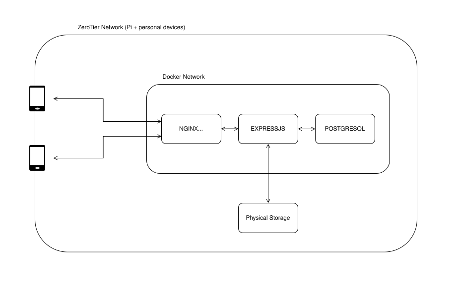

# The Left Drawer
A self-hosted personal cloud storage system with a web interface, built to run on a Raspberry Pi.

`Docker` `Nginx`  `ExpressJS` `PostgreSQL` `React` `TypeScript`

## Live Demo

[View here](leftdrawer-demo.milena.work)

Credentials:
- username: Demo
- password: DemoPw123

## Why I built this

We were storing all our family pictures on random SSDs. Every time my non-technical mother wanted to see them we had to sit at the PC and swap between various disks. Now she can access all of her files whenever she wants, without privacy concerns, without having to pay a monthly fee, but most importantly with an interface that is simple, straightforward and that she will never struggle to use.

## Architecture

<p align="center">
  
</p>

A ZeroTier network is used to create a private virtual network that includes the Raspberry Pi hosting the application. All authorized devices connected to this ZeroTier network can securely communicate with the Pi, while the services remain inaccessible from the public internet.

The frontend application is a pre-built React bundle served by NGINX. NGINX delivers the static frontend files on port 80 of the Raspberry Pi. This port is only reachable within the ZeroTier virtual network.

When a user triggers an API request from the browser:
1. The browser sends the request to NGINX through the ZeroTier network
2. NGINX forwards the request to ExpressJS through the internal Docker network
3. The API receives requests forwarded by NGINX, communicates with the database service and sends responses back using the same internal Docker network

When physical file storage is required, the API first queries the database to determine the relevant file metadata, then it retrieves the corresponding files from storage.

> This is the architecture on my self-hosted project. The Demo lives on a VPS, with sample data. I'm way less concerned about security in that environment, so ZeroTier is not present and NGINX forwards port 80 to my subdomain.


## Features

- Closed system: registration requires an admin secret, keeping the app private by design
- Login and persistent sessions across multiple devices
- Upload, preview, download, move, and delete files and folders
- Image thumbnail generation with authenticated lazy loading

## Technical deep-dive
### Authentication

JWT with short-lived access tokens (5 min) and httpOnly refresh token cookies. Silent session restoration on page load via a /refresh call. Refresh tokens are SHA-256 hashed before storage so a database breach doesn't expose valid tokens. JWT verification pins the algorithm to HS256 to prevent algorithm confusion attacks. The refresh cookie is path-scoped to /api/auth to minimize its transmission surface.
### Token management in the frontend

Access tokens live in module scope outside React - not localStorage (XSS risk), not React state (stale closure risk in the fetch interceptor). The `fetchWithAuth` interceptor always reads the current value and silently refreshes on 403 before retrying the original request.
### File operations and consistency

Upload, delete, and move operations use PostgreSQL transactions.
The delete endpoint moves files to a trash folder before removing DB records - if the filesystem operation fails, the transaction rolls back. True atomicity between the DB and filesystem isn't possible, so partial failures log an explicit consistency warning. The roadmap includes a soft-delete pattern to handle this more cleanly. The move endpoint uses fs.rename() which can silently fail across filesystem boundaries - known limitation documented in the roadmap.

Every endpoint that constructs a physical path makes sure it starts with /app/storage/ before any operation, on top of regex checks, preventing path traversal attacks.

The schema uses cascading deletes so removing a user or folder cleans up all child records automatically. Indexes are placed on foreign keys and frequently queried columns. An `updated_at` trigger keeps file metadata current without relying on application-level updates.
### Frontend performance

Thumbnails are generated server-side with Sharp (200x200 WebP) on upload. 
Thumbnails couldn't be loaded with a plain `` tag because the browser has no way to attach an Authorization header to image requests - a fundamental constraint of the HTML img element. The options were:
- cookie-based auth (adds complexity and attack surface, mixing auth mechanisms)
- unguessable public URLs (security through obscurity)
- fetching with auth headers and converting to blob URLs
I chose the blob URL approach, with an IntersectionObserver to avoid firing too many fetch requests when a folder opens with 200 images. Only thumbnails that scroll into view (with a 200px lookahead) are fetched as authenticated blobs, converted to object URLs, tracked in a ref and revoked on unmount or file change to prevent memory leaks.
Async effects use a cancel flag - if the component unmounts or dependencies change before a fetch completes, the result is discarded and no state update occurs.
### Infrastructure

Multi-container setup with Docker Compose: Nginx, Express, PostgreSQL, and a multi-stage frontend build (React bundle baked into the Nginx image). Dev and prod environments share a base compose file with a dev override that swaps the backend for a nodemon/ts-node live-reload setup and proxies the frontend to the Vite dev server on the host.
Noteworthy debugging: PostgreSQL 18 changed its default data directory from /var/lib/postgresql/data to a versioned path, causing data to be wiped on every restart. Diagnosed from container logs, fixed by explicitly setting PGDATA.


## How to run this project

Clone the repo and cd into the project folder.
```bash
#rename the .env.example file and modify it as you see fit
cp .env.example .env
```

**Development:**
```bash
docker compose -f docker-compose.yml -f docker-compose-dev.yml up --build -d
#start frontend
cd frontend/
npm install
npm run dev

#access the app at http://localhost (everything goes through NGINX port 80)
```

**Production (self-hosting without SSL -> private networks only):**

After cloning the repo and fixing the .env file start all the services at once:
```bash
docker compose -f docker-compose.yml -f docker-compose-selfhost.yml up -d --build
```
And access the app at http://localhost.

**Production (with SSL -> personal domain required):**

After cloning the repo and fixing the .env file start all the services at once:
```bash
docker compose -f docker-compose.yml -f docker-compose-prod.yml up -d --build
```
Enable `SECURE_COOKIES` in the .env file.

#register a user with:
curl -X POST http://localhost/api/auth/register -H "Content-Type: application/json" -H "x-admin-secret: your_admin_secret" -d '{"username": "testuser", "password": "password123"}'

If you want to populate the app with files already on disk, a utility script is included. Edit the username at the top of `scripts/importFiles.js` and, after you copied your files to the storage folder, run: 
```bash
docker compose exec backend node scripts/importFiles.js
```
The script is idempotent - safe to re-run, it skips files already in the database.

## Known limitations and Roadmap

- [ ] 401 on page load - normal JWT behaviour, need to add a non-httpOnly non-sensitive cookie to manage refresh 
- [ ] No option for users to change their password (add verification)
- [ ] Move and Delete endpoints could fail, especially if a separate disk is used for storage (`fs.rename()` in the move endpoint can silently fail across filesystem boundaries)
	- [ ] Implement soft delete and do a move endpoint revision
- [ ] Currently I have no observability, all the checks are manual
	- [ ] Pino, Grafana, Prometheus could all be valid options